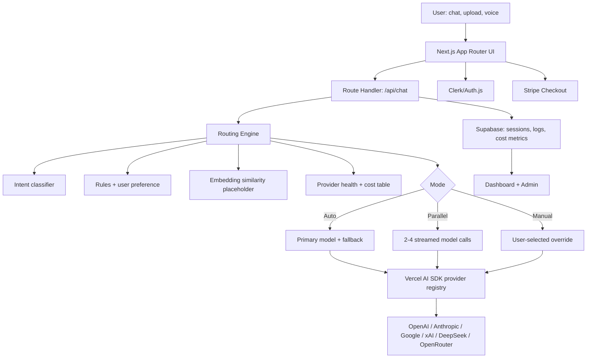

# NexusRoute AI Architecture

## 产品架构图



## 目录结构

```txt
app/
  api/
    chat/route.ts          # 聊天 API，占位 Vercel AI SDK streamText
    route/route.ts         # 仅路由决策 API
  admin/page.tsx           # 模拟后台与路由日志
  chat/page.tsx            # 主工作台
  dashboard/page.tsx       # 使用统计与节省报告
  onboarding/page.tsx      # BYOK 入门流程占位
  pricing/page.tsx         # Stripe 订阅占位
  privacy/page.tsx         # 隐私政策占位
  page.tsx                 # Landing Page
components/
  chat/                    # 聊天工作台与路由面板
  dashboard/               # Recharts 图表
  site/                    # 导航与 Hero Demo
  ui/                      # 小型 shadcn 风格基础组件
lib/
  routing/engine.ts        # 核心路由算法
  models.ts                # 模型注册表
  demo-data.ts             # 融资 Demo 假数据
  types.ts                 # 全局类型
scripts/
  seed-demo.ts             # 演示数据种子脚本
docs/
  ARCHITECTURE.md          # 架构、伪代码、部署和路演材料
```

## 路由算法伪代码

```ts
intent = lightweightClassifier(query, attachments)
candidateModels = providerRegistry.filter(capabilities match intent)

for each model:
  score = weighted(quality, latency, cost, context, health, userPreference)
  score += embeddingSimilarity(query, modelStrengthExamples)
  score -= penalties(missing vision/tools, degraded provider, budget cap)

if manualOverride:
  return selectedModel with audit trail

if parallelMode:
  stream top 2-4 models and compare cost/quality

return bestModel + fallback + confidence + explainable routing reasons
```

当前 MVP 的核心逻辑在 `lib/routing/engine.ts`：

- 轻量分类器：关键词 + 文件/图像信号，识别 reasoning、creative、code、search、vision、document、realtime、general。
- 规则打分：质量、速度、成本、上下文长度、工具能力、视觉能力、实时 provider 状态。
- 用户偏好：balanced、quality、speed、savings、freshness。
- 手动覆盖：保留 audit trail。
- 并行模式：返回 Top 2-4 个模型候选，供前端 split-view 展示。
- 回退策略：主模型之外的最高分模型作为 fallback。

## 后端集成建议

### Vercel AI SDK

生产版本可把 `app/api/chat/route.ts` 中的模拟响应替换为：

```ts
import { streamText } from "ai";
import { openai } from "@ai-sdk/openai";

const result = streamText({
  model: openai("gpt-4.1"),
  messages
});

return result.toDataStreamResponse();
```

然后根据 `decision.primary.model.provider` 映射到 Anthropic、Google、xAI、DeepSeek 或 OpenRouter provider。

### Supabase Schema

```sql
create table workspaces (
  id uuid primary key default gen_random_uuid(),
  name text not null,
  plan text not null default 'free',
  created_at timestamptz default now()
);

create table routing_logs (
  id uuid primary key default gen_random_uuid(),
  workspace_id uuid references workspaces(id),
  user_id text not null,
  query text not null,
  intent text not null,
  model_id text not null,
  confidence int not null,
  latency_ms int not null,
  estimated_cost numeric not null,
  saved_percent int not null,
  status text not null,
  created_at timestamptz default now()
);
```

### Clerk/Auth.js

- Clerk 适合快速融资 Demo：开箱用户、组织、多租户。
- Auth.js 适合完全自托管和更细的数据控制。
- MVP 里先保留环境变量和页面闭环，下一步接 middleware 保护 `/chat`、`/dashboard`、`/admin`。

### Stripe

- Free: BYOK + 基础路由
- Pro: 并行模式 + 节省报告
- Team: Admin 日志 + 团队预算 + 多租户权限

## 部署指南

1. 推送到 GitHub。
2. Vercel 导入项目，Framework 选择 Next.js。
3. 设置 `.env.example` 中的环境变量。
4. 若暂不接真实 AI Key，保持当前模拟响应即可演示完整体验。
5. 接 Supabase 后执行上方 schema，并将路由日志写入 `routing_logs`。
6. Stripe 接入 Checkout 与 webhook，按 plan 控制月度路由额度。

## Pitch Deck 辅助素材

### 关键截图

1. Landing Hero：展示“统一聊天 + 智能路由全球顶级 AI”的第一印象。
2. Chat Workspace：输入复杂问题后，右侧显示 Claude / Grok / Gemini 路由过程。
3. Parallel View：同一查询 2-4 模型并行响应，突出与普通聚合器的差异。
4. Dashboard：本月节省 42%、路由准确率 92%、响应时间下降。
5. Admin：100+ 用户、路由日志、fallback 状态，证明可运营。

### 5 分钟 Demo 脚本

1. 打开首页：一句话讲定位，“我们不是另一个聊天壳，而是 AI 模型选择和成本控制层。”
2. 进入 Chat：输入“分析融资 memo 风险并生成 VC Q&A”。
3. 展示路由面板：解释为什么 Claude 做深度推理、Grok 做新鲜信息、Gemini 处理视觉/文档。
4. 切到 Parallel：让投资人看到多模型比较，而不是用户手动来回切换。
5. 打开 Dashboard：展示 42% 节省和 92% 准确率，把产品价值转成预算语言。
6. 打开 Admin/Pricing：说明 BYOK 降低平台成本，订阅和团队管理可以商业化。

### 竞品对比表

| Capability | NexusRoute AI | Poe | TypingMind | Aymo |
| --- | --- | --- | --- | --- |
| Explainable smart routing | Yes | Limited | Manual-first | Limited |
| Parallel model comparison | Yes | Partial | Partial | Partial |
| Cost savings dashboard | Yes | No | No | No |
| BYOK risk reduction | Yes | No | Yes | Varies |
| Admin routing logs | Yes | No | No | No |
| Investor-ready ROI story | Strong | Weak | Weak | Medium |

## Roadmap

### Next 2 weeks

- 接入真实 Vercel AI SDK streaming。
- Clerk 多租户登录与组织。
- Supabase session、routing_logs、usage_metrics。
- Stripe Checkout + plan limits。
- 文件上传到 Supabase Storage，PDF 文本抽取后进入路由。

### Next 4-6 weeks

- 嵌入向量相似度：用历史成功路由样本提升推荐。
- Provider health worker：定时记录失败率、延迟和限流。
- 成本预算警报与团队 policy engine。
- Shareable session 和公开 Demo 链接。
- RAG / Agent / 企业工具连接占位变成真实集成。

### Seed round narrative

NexusRoute 可以从 AI 聚合聊天扩展为企业 AI 使用控制平面：统一入口、路由策略、成本治理、合规审计和供应商抽象。前端 Demo 负责让人“看见魔力”，Dashboard 负责让 CFO 看见 ROI。
